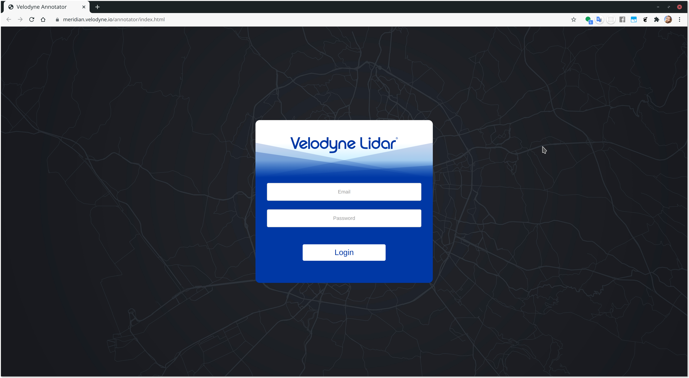
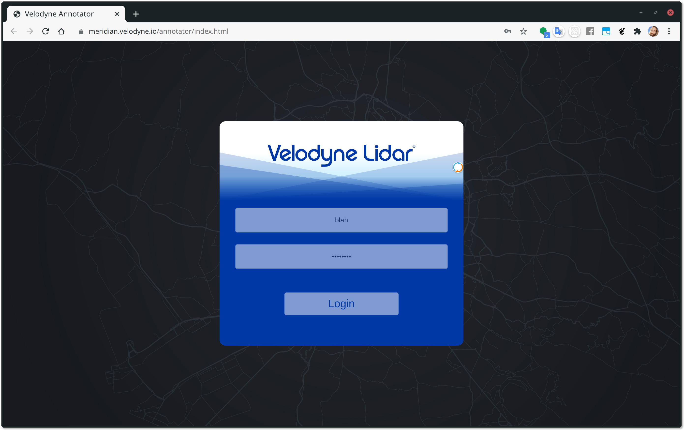
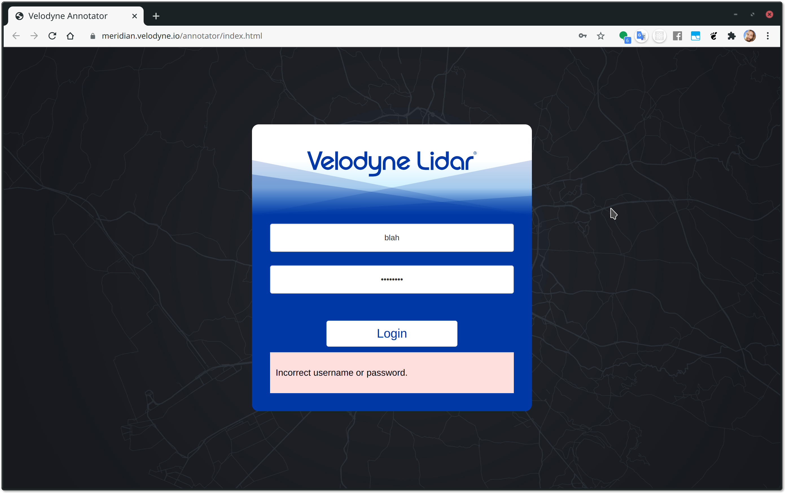

# `@velodyne/authentication-ui`

Authentication UI for logging into Velodyne frontend applications.

This povides consumers a `<log-in>` element that displays a Velodyne-style login form for handling username and password form interaction on the client side.

This element has no database connection, it is a pure UI component. Further connection to a desired back end is required.

# Getting started

You'll need to connect your `npm` cli to our private `@velodyne` registry in
order to install `@velodyne/authentication-ui`. See our Confluence doc on
[setting up
NPM](https://velodynelidar.atlassian.net/wiki/spaces/DCTMain/pages/1517814033/Package+Management+JFrog+NPM+Conan+Pip+etc).

Once that is set up, you can run `npm install @velodyne/authentication-ui` in
your npm-managed web project.

# Usage

The `<log-in>` HTML element is nothing more than a form-based UI implementing
the UX patterns related to login (and soon signup). It has form fields for users to input
username and password and allows to specify an error message. Soon, it will
have a customizable password reset button, and other features needed for a
login/signup UX flow.

The project using this lib should listen to the `authsubmit` event of the
`<log-in>` element, then use the event `username` and `password` payload to
implement the actual authenticatio with a desired backend server.

## Example

First import the element into you web project:

```js
import '@velodyne/authentication-ui'
```

Then place the element into your app's markup. In the following snippet,
we've made a very basic HTML file, and we've made the login screen take up
the full view (the `<log-in>` element is currently designed to take up the
whole view, but feel free to make a PR to suggest more flexible placement!),
and we've given it no options:

```html
<style>
	html,
	body,
	log-in {
		width: 100%;
		height: 100%;
	}
</style>
<body>
	<log-in></log-in>
</body>
```

This will show a login screen that looks like this:



When the user inputs a username and password and then submits the form, an
`authsubmit` event will be emitted from then `<log-in>` element, which we can
listen to in order to log the user in. For example, we add a script to listen
for the event:

```html
<script>
	const login = document.querySelector('log-in')

	// When the user clicks the Login button or hits the Enter key, this event
	// will be triggered.
	login.addEventListener('authsubmit', event => {
		console.log(event.detail.username)
		console.log(event.detail.password)

		// Do something with the username and password like log the user into
		// your backend service.
	})
</script>
```

Keep in mind, `<log-in>` is only a UI component, it is up to you to take the
username and password and authenticate with a backend.

The `<log-in>` element has two attributes (with equivalent JS properties) in
order to tell the UI which UX feature to enable.

For example, while you are calling your backend with the username and
password, you can set the `authenticating` attribute to make the login UI
have a visual waiting/loading state in which the input fields are disabled
and a spinner is displayed, and if you get an authentication error from you
backend, you can set the `errorMessage` JS property (or `error-message` DOM
attribute) to show a red error message:

```js
	login.addEventListener('authsubmit', event => {
		// Do something with the username and password like log the user into
		// your backend service.

		// In the meantime, set the login UI to a visual waiting state:
		login.setAttribute('authenticating', '')
		// or
		login.authenticating = true

		// Later, once the request completes:
		if (/* ...authentcation failed... */) {
			const error = 'Login failed because invalid password.'

			login.setAttribute('error-message', error)
			// or
			login.errorMessage = error // JS properties map to equivalent dash-case attributes
		}

		// Regardless of the error, disable the loading state (re-enables the input fields):
		login.authenticating = false

		// At this point, perhaps you want to remove the login UI, and replace it
		// with your app's UI now that the user is logged in:
		login.remove() // Removed the UI from the DOM.
		document.body.append(someOtherElement)
		// ...
	})
```

The loading state looks like this:



An error message looks like this:



That's about it!

# React

The `<log-in>` element is just an HTML element. If you're using React, you can manipulate it just like any other element. For example,

```jsx
import '@velodyne/authentication-ui'
import * as React from 'react'
import * as ReactDOM from 'react-dom'

class MyApp extends React.Component {
	state = {loggedIn: false}

	// ...

	render = () => (
		// If not logged in, show the log-in screen, otherwise show the app UI:
		<div>
			{this.state.loggedIn ? (
				<div>Your app UI here.</div>
			) : (
				<log-in authenticating={/*...*/} errorMessage={/*...*/} />
			)}
		</div>
	)
}

ReactDOM.render(<MyApp />, document.body)
```

# @lume/element

If you're making custom elements with `@lume/element` (like the `<log-in>` element itself), you can use it in your `template`:

```jsx
import '@velodyne/authentication-ui'
import {Element, element} from '@lume/element'
// ...

@element('my-app')
class MyApp extends Element {
	@reactive loggedIn = false

	// ...

	template = () => (
		// If not logged in, show the log-in screen, otherwise show the app UI:
		<div>
			<Show when={this.loggedIn}>
				<div>Your app UI here.</div>
			</Show>
			<Show when={!this.loggedIn}>
				<log-in authenticating={/*...*/} errorMessage={/*...*/} />
			</Show>
		</div>
	)
}

document.body.append(new MyApp())
```

# Other view libs/frameworks

`<log-in>` is just an HTML element. Use it with jQuery, Vue, Angular, Svelte,
React, LUME Element, or anything else just like you would with any other HTML
element!

# TODO

-   [ ] Password reset button
-   [ ] Sign up flow

# Development

In one terminal:

```sh
npm install
npm link # link to NPM's local global package cache
npm run dev # re-builds on file changes
```

In another terminal, in another project, link the lib for rapid development
to see changes right away:

```sh
npm link @velodyne/authentication-ui
npm run dev # or similar
```
